# simufact-weld-pipeline

[](https://github.com/gArtll/simufact-weld-pipeline/actions/workflows/ci.yml)
[中文](README.zh-CN.md)

**A headless, rule-driven pre-processing and verification pipeline for Simufact Welding.** It takes a part's STEP
file to a checked Simufact project: it recognises the weld joints, decides what it can build and with which method,
meshes the parts as structured hexahedra, builds the weld beads, assembles the Simufact project by script, and proves
the solver input is what it should be -- before hours of welding simulation are spent on it.

Every decision that depends on the part is traceable: each process, tooling and machine parameter carries its
source, nothing is inherited from a previous case, and a fixed review page must be clean before a long run may start.
The pipeline is designed to be driven by an AI coding agent under explicit rules ([AGENTS.md](AGENTS.md)).

```mermaid
flowchart LR
  A[new<br/>blank case] --> B[inspect<br/>STEP joints + frame]
  B --> C[plan<br/>capability matrix]
  C --> D[provenance<br/>every value sourced]
  D --> E[review<br/>dashboard]
  E --> F[hm<br/>structured HEX]
  F --> G[mesh gate]
  G --> H[preflight]
  H --> I[prep<br/>weld beads]
  I --> J[build<br/>Simufact project]
  J --> K[gate<br/>.dat input check]
  K --> L[run]
  L --> M[post / report]
```



## What is implemented

| Area | What it does | Where |
|---|---|---|
| **STEP joint recognition** | reads the B-rep (planes, cylinders, B-spline surfaces), classifies parts (plate, curved plate, tube, solid) and joints (T, butt, lap, tube-on-plate, tube T) from which faces touch; finds the seams and the equal / variable section of each part | `capability/classify.py`, `capability/geometry.py` |
| **Capability planning** | matches joint features against a capability matrix: mesh backend, bead and contact strategy, the tooling and process inputs the user must supply, official Simufact references for the method. A recognised joint is *detected*; it is *supported* only when its whole chain has CI tests and solver runs behind it. Anything else is a reported capability gap, never "the closest existing case" | `capability/planner.py`, `capability/matrix.yaml` |
| **Provenance and lifecycle** | a new case starts blank; every critical parameter needs a source (CAD, official example, user, process document, derived, measured, ...); values borrowed from another case are blocked unless approved, and copied files are caught by content. Fixed stages with a state file; a formal run is refused while the review page shows anything open | `common/provenance.py`, `common/lifecycle.py` |
| **Local joint frame** | web normal, seam direction and joint normal measured on the CAD; meshing and bead building work in that frame, so a part is used in whatever orientation its STEP comes (tested: a rotated T joint gives the rotated bead to < 1e-6 mm) | `capability/classify.py`, `prep/frame.py` |
| **Structured HEX meshing** | the web face meshed from its CAD outline with explicit transition templates (fine at the weld, coarse in the far field, notches, hard points for constraints), swept through the thickness; all-hexahedral, checked (Jacobian, topology, CAD boundary deviation) | `mesh_transition/web.py`, `hm/explicit_web.py` |
| **Plate backends** | equal-section plates swept with layers graded away from the weld; **mapped plate** for plates whose section changes: end profiles matched station by station, every level projected onto the real CAD faces (planes, cylinders, B-splines) | `mesh_transition/plate.py`, `mesh_transition/mapped_plate.py` |
| **Weld beads** | root lines, fillet bead sections at equal arc length (open seams and closed rings), node snapping against micrometre near-coincidences, outer-surface weld lines, detJ checks | `prep/` |
| **Contact planning** | no repository-wide contact default: a new project gets its capability's default with the basis shown; an explicit alternative (one-way bead-first table) only with an official, user or process-document source; regression cases keep the contact they were solved with | `common/contact.py` |
| **Simufact scripting** | project assembly by `runscript`, offline patches for what the API does not expose (trajectory orientation settings, contact table) | `build/` |
| **Input check** | parses the solver input (`.dat`) and compares its key sections with a reference or with itself -- the check that caught every silent difference during development | `gate/` |
| **Review dashboard** | a static HTML page per case, regenerated after every stage from the stage manifests: joints, plan, contact decision, parameter sources, machine, mesh checks, run statistics | `ui/report.py` |
| **Solver statistics and post** | exit number, progress, inverted elements, retried increments from `.sts` / `.out`; probes by physical coordinate with thermal cycle, t8/5, cooling rate | `run/` |
| **CI** | unit and integration tests, two synthetic example cases through `prep` and `gate --self`, input-check regression table, absolute-path and private-data scanners, on Windows and Ubuntu × Python 3.10 / 3.13 | `.github/workflows/ci.yml` |

## Support matrix

| Joint | Status |
|---|---|
| T joint, planar web (any axis-aligned orientation), plate of equal section | **supported** |
| T joint, plate of variable section (`mapped_plate`) | meshes and preps; **unverified** until built and smoke-run with it -- a formal run is blocked |
| tube on plate, closed circumferential fillet | **partial**: beads, build and check supported; base mesh supplied by the user |
| butt, groove / multi-pass, lap, tube T joint, oblique or curved web, assemblies of more than two parts | **detected, not supported** (capability gaps with official references) |

## Quick start

Python ≥ 3.10 with `numpy`, `scipy`, `pyyaml`, `pytest`. No Simufact and no HyperMesh are needed for these steps.

```bash
pip install numpy scipy pyyaml pytest
```

```bash
python -m pytest tests -q
```

```bash
python weldsim.py prep cases/example_synthetic.json
```

```bash
python weldsim.py gate cases/example_synthetic.json --self
```

```bash
python weldsim.py prep cases/example_tube_synthetic.json
```

A new part, from its STEP (review page at `runs/part/dashboard/index.html`):

```bash
python weldsim.py new part.json --step part.stp
```

```bash
python weldsim.py inspect part.json
```

```bash
python weldsim.py plan part.json
```

```bash
python weldsim.py review part.json
```

`build`, `gate` against a reference, `run` and `post` need a Simufact Welding licence; the machine paths go into
`config.yaml` (from `config.example.yaml`). Field reference: [case_schema.md](case_schema.md); how each step works:
[docs/how-it-works.md](docs/how-it-works.md); independent reproduction brief: [docs/reproduce.md](docs/reproduce.md).

## Validation

The tool was developed against real welding models (a T joint on a curved plate and a tube on plate) with GUI-built
Simufact reference projects: headless projects reproduced the reference solver input section by section, tool-built
beads matched the reference peak temperatures within 5 % in short solves, and a repeated solver failure was traced
to a contact near-coincidence and fixed. Those models are not published; what they established is in
[docs/validation.md](docs/validation.md) as method, and CI re-checks the pipeline on synthetic inputs on every push.
Heat sources are literature / screening values, not experimentally calibrated.

## Simufact scripting notes

Details: [docs/simufact-api-notes.md](docs/simufact-api-notes.md).

| Rule | Content |
|---|---|
| R6′ | `calculate_all_orientations`: new project only, once per trajectory; `calculate_all_projections`, `Trajectory.delete_geometry`, `Project.delete_geometry`, `split_at`: banned |
| R7 | trajectory settings and contact table: Simufact closed, offline XML (`robots_properties.xml`, `_contact_table/properties.xml`) |
| R17 | outer-surface weld line: `search_radius=5 mm` in `calculate_all_orientations`; default radius → `ACCESS VIOLATION` |
| R18 | weld line CSV header `0;1;0;0` → global-vector; `wl.orientation = "local-vector"` after import |

| Banned method | Effect |
|---|---|
| `calculate_all_projections` | weld line moved to the surface; `connect_to_nodes`, orientation mode, variation angle reset; NDSQ and orientation tables removed |
| `Trajectory.delete_geometry` | `ValueError` on a mounted bead |
| `Project.delete_geometry` | next `import_geometry` → `ACCESS VIOLATION` |
| `Trajectory.split_at` | bead assignment and orientation settings cleared |

## Roadmap

| Next | Content |
|---|---|
| solver resources | measure instead of assume: short smoke benchmarks over domain × thread layouts (wall time, CPU/wall, memory, licence tokens) → a measured parallel setting; runtime estimate before a long run |
| process robustness | time step vs bead section spacing (R21) advice, clamping fixation start / end times passed through, a 2 s web-on-plate smoke case (which also verifies `mapped_plate` end to end) |
| new joint types | butt joint, lap joint, multi-layer / multi-pass grooves, curved and multiple seams, assemblies -- each with synthetic tests and its official reference |
| tubes | a CAD mesher for tube-on-plate base meshes |

Design and phase plan: [docs/architecture_refactor.md](docs/architecture_refactor.md).

## Data and licences

The code is MIT-licensed; the MIT licence does not extend to data it does not cover. The repository holds only
synthetic data (`cases/example_synthetic`, `cases/example_tube_synthetic`, `tests/failure_logs`), each file generated
by a script in the repository and registered with its origin in `tools/public_data_allowlist.yaml`. No Simufact
example files, geometry or values are included: `official/references.yaml` only names example paths of a local
installation and the method each one shows. Data of real models is never committed, and CI refuses it
(`tools/check_private_data.py`).

## License

[MIT](LICENSE) · [CITATION.cff](CITATION.cff)
